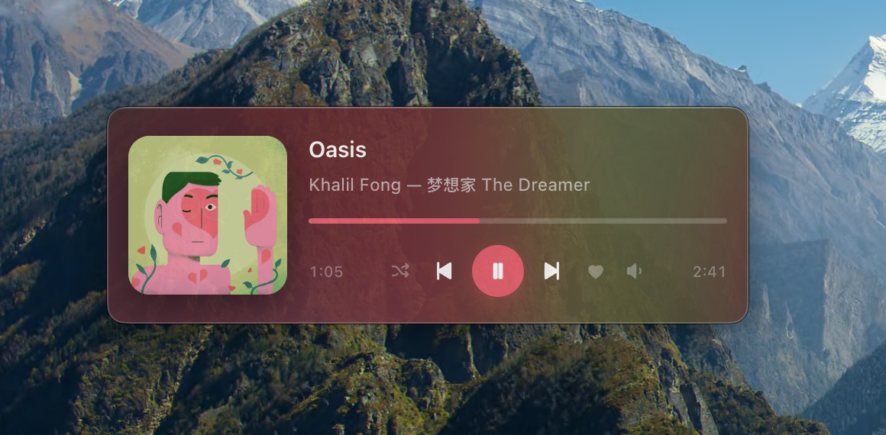

# Pear Music Widget

A floating now-playing widget and menu-bar player for macOS, driven by the
**API Server** plugin in [pear-desktop](https://github.com/pear-devs/pear-desktop)
(and its predecessor [th-ch/youtube-music](https://github.com/th-ch/youtube-music)).

Inspired by [YoutubeMusicCoverWidget](https://github.com/rafailpapastamou/YoutubeMusicCoverWidget),
which polls the same API server from an Übersicht widget. This one is a
standalone Electron app that holds the API server's **WebSocket** open instead,
so track, position, volume and shuffle changes arrive as push events rather than
on a timer.



## Two surfaces

**A menu-bar dropdown** — click the play icon in the menu bar for a popover with
artwork, transport, a scrubable progress bar and a countdown. Closes on
click-away or Escape. Meant to replace the system Now Playing item.

**A floating widget** — a resizable panel you can park anywhere on the desktop.

Both are the same renderer on the same state, so they never disagree.

| Tray icon | |
| --- | --- |
| **Left click** | Open/close the player dropdown |
| **Right click** | Settings — widget visibility, size, opacity, always on top, open at login, reconnect, quit |
| **Solid glyph** | Connected |
| **Hollow glyph** | YouTube Music not running, or its API server is off |

If YouTube Music is not running, pressing play launches it.

## Skins

Three layouts, switchable from the menu bar under **Skin**.

| Skin | Natural size | Layout |
| --- | --- | --- |
| **Classic** | 360×132 | Artwork left, titles and transport right. Has a Compact variant (280×103) the widget switches to automatically as you drag it smaller. |
| **Cinema** | 390×168 | Artwork centred as a full-height band faded into the card, title left, large play button on the right, transport along the bottom. |
| **Stack** | 330×284 | Artwork and titles on top, centred transport, full-width progress, and the next four queued tracks below — click any to play it. |

## Search

The magnifier in the top-right corner opens a search panel: the widget grows
downwards, you type, and results come back with artwork. Click one — or use
**↑ / ↓** and **Enter** — to play it. **Escape** closes.

Results are queued directly after the current track and jumped to by queue
index, so a song ending mid-click cannot make it play the wrong thing.

## Features

- Real macOS vibrancy, native rounded corners and shadow
- Accent colour extracted from the cover art on every track change
- Play/pause, next, previous, shuffle, like (right-click the heart to dislike)
- Scrubable progress bar
- Volume three ways: drag the popover on the speaker, scroll anywhere on the
  card, or **↑ / ↓** while focused (**Shift** for 1% steps)
- Drag any edge to resize — aspect locked, and the layout scales rather than
  reflowing
- Light and dark appearance; position, size and skin remembered across launches
- No Dock icon

There is no repeat button: `GET /api/v1/repeat-mode` returns `null`
unconditionally on the shipped plugin, so repeat state cannot be displayed
truthfully.

## Install

Download the DMG from [the latest release](https://github.com/TianCal/pear-music-widget/releases/latest),
open it, and drag the app onto Applications.

It is ad-hoc signed but not notarised, so a downloaded copy arrives quarantined —
right-click → Open the first time, or:

```bash
xattr -dr com.apple.quarantine "/Applications/Pear Music Widget.app"
```

Then enable the **API Server** plugin in YouTube Music (menu → Plugins). On first
run the widget asks for an access token; if the plugin's auth strategy is
`AUTH_AT_FIRST`, approve the dialog that appears inside YouTube Music.

Requires macOS on Apple Silicon. Built and tested on macOS 26.

## Running from source

```bash
cd ~/projs/pear-music-widget && npm install && npm start
```

If the widget sits on a setup screen, run the connectivity check:

```bash
npm run doctor
```

To build the DMG yourself: `npm run build`.

## Compatibility

The `api-server` plugin is versioned independently of the host app and can change
its protocol. This release targets:

| | |
| --- | --- |
| API surface | `/api/v1` |
| Verified against | YouTube Music **3.12.0**, bundle `com.github.th-ch.youtube-music` |
| Default endpoint | `http://127.0.0.1:26538` |

`npm run doctor` checks the server's OpenAPI document and fails loudly if the
plugin moves off `/api/v1`, rather than leaving the widget silently blank. The
full endpoint list, the protocol quirks worked around, and where to change things
are in [AGENTS.md](AGENTS.md).

## Configuration

`~/Library/Application Support/pear-music-widget/settings.json` — `host`, `port`,
`clientId`, cached `token`, window `bounds`, `appearance`, `alwaysOnTop`,
`opacity`. Quit the app before editing.

## Assets

No third-party assets, nothing to attribute. The transport glyphs are
hand-authored SVG paths in the `<symbol>` sprite in
[src/renderer/index.html](src/renderer/index.html); the menu-bar icons and the
app icon are computed procedurally at build time by
[scripts/make-icon.js](scripts/make-icon.js). The only binary in the repo is the
screenshot.

## Contributing

[AGENTS.md](AGENTS.md) documents the architecture and the non-obvious behaviour —
read it before changing the volume path, the resize/zoom logic, or the tray menu.
