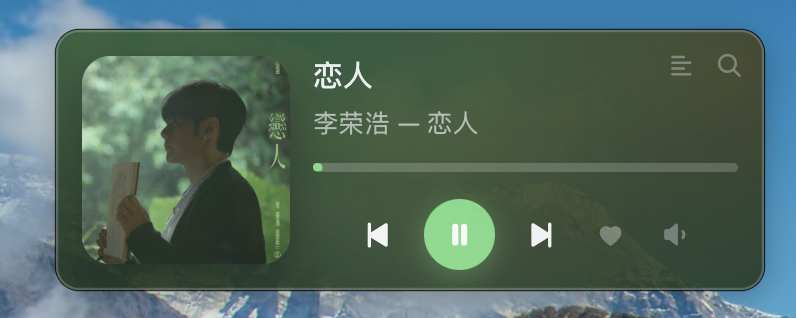
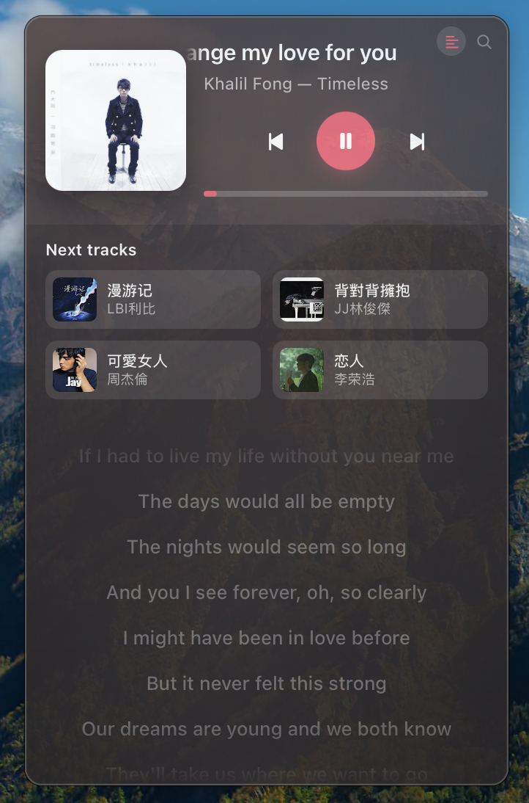

# Pear Music Widget

A floating now-playing widget and menu-bar player for macOS, driven by the
**API Server** plugin in [pear-desktop](https://github.com/pear-devs/pear-desktop)
(and its predecessor [th-ch/youtube-music](https://github.com/th-ch/youtube-music)).

It holds the API server's **WebSocket** open, so track, position, volume and
shuffle changes arrive as push events rather than on a timer.

Inspired by [YoutubeMusicCoverWidget](https://github.com/rafailpapastamou/YoutubeMusicCoverWidget),
which polls the same API server from an Übersicht widget.



## Two surfaces

**A menu-bar dropdown** — click the play icon in the menu bar for a popover with
artwork, transport, a scrubable progress bar and a countdown. Closes on
click-away or Escape.

**A floating widget** — a resizable panel you can park anywhere on the desktop.

Both are the same renderer on the same state, so they never disagree.

| Tray icon | |
| --- | --- |
| **Left click** | Open/close the player dropdown |
| **Right click** | Settings — widget visibility, skin, dropdown skin, cover tint, opacity, lyrics timing, corner buttons, always on top, reset size and position, open at login, reconnect, quit |
| **Solid glyph** | Connected |
| **Hollow glyph** | YouTube Music not running, or its API server is off |

If YouTube Music is not running, pressing play launches it. **Double-clicking the
card** brings it to the front. Every menu carries **Quit with App**, which closes
YouTube Music before quitting the widget.

## Skins

| Skin | Natural size | Layout |
| --- | --- | --- |
| **Classic** | 300×110 | Artwork left, titles and the full transport right |
| **Stack** | 330×284 | Artwork and titles on top, centred transport, full-width progress, and the queue below — scroll it sideways for what is coming and what has already played, and click any card to jump to it |

**Skin** sets the floating widget, **Dropdown skin** the menu-bar popover, and
they are independent. Dragging an edge scales whichever skin is showing; it never
switches between them.



*Stack, with the lyrics panel open.*

## The queue

The left-hand corner button opens the **whole playlist**, on any skin and in the
dropdown too. Tracks you have already played sit above the one playing, which is
marked; everything still to come is below it. Click any row to jump straight to it — including one you have
already heard. Leave the panel open and it reopens next launch.

Stack shows the same queue inline, as a strip you scroll sideways — six tracks
to a view, with the one playing centred, what came before it to the left and
what is next to the right. Scrolling it never touches the volume.

Artwork is fetched for the rows you can actually see, so a fifty-track queue
costs about as much as a four-track one.

## Corner buttons

The four buttons in the top-right corner — **Repeat**, **Queue**, **Lyrics** and
**Search** — can each be turned off from **Corner buttons** in any of the menus.
Turn them all off and the title gets the whole card back, which is worth doing on
Classic.

The set is remembered **per skin**, and each menu edits the skin of the surface it
belongs to: four buttons sit comfortably over Stack's titles and crowd Classic's,
so you can keep an answer for each rather than re-flipping them every time you
switch. The dropdown's own right-click menu edits the dropdown's skin.

The same submenu can fade them out once the pointer has been still for a few
seconds, under **Hide when idle**. Moving the mouse over the card brings them
back. They fade with a panel open too — clicking the card brings them back
before the click lands, so a faded button never leaves you stuck in one.

## Lyrics

The lyrics icon opens a rolling lyrics panel on any skin. The line being sung is
highlighted and held just above centre, clicking a line seeks to it, and
scrolling over the panel scrolls the lyrics rather than the volume. Leave the
panel open and it reopens next launch.

Only the middle of a line takes a click — the ends are there to be read past, so
a stray click while you scroll cannot throw the song somewhere else.

When the words and the music disagree by a beat, **Lyrics timing** nudges the
roll in half-second steps, up to two seconds either way. It is one setting for
every track, not per song: the drift is between the timings and the player's
clock, so whatever corrects one track usually corrects the next. Seeking by
clicking a line follows the same correction, and the setting is remembered.

**Simplified Chinese lyrics** converts the words on the way to the panel, for the
large part of the Mandarin and Cantonese catalogue that comes back traditional.
It is phrase-aware rather than a character swap, so 乾淨 becomes 干净 while 乾坤
stays 乾坤. Turning it back off restores the original words without refetching
them, and anything already simplified — or not Chinese — is left alone.

Lyrics come from YouTube Music's own timed lyrics first — they are looked up by
video id, so they are always the track that is playing — and from
[LRCLib](https://lrclib.net) when YouTube has none, or has them without timings
and LRCLib has them with. **This is the only time the widget talks to anything
other than localhost**: it sends the video id to YouTube, and the title and
artist to LRCLib. Tracks with no synced lyrics fall back to a plain block, and
tracks with none say so.

Whatever is found is kept on disk, so the same track costs nothing the next time
— or the next launch. **Lyrics cache** in the menu-bar menu sets how much room
that may take (50MB by default, which is thousands of songs; the oldest go first
once it is full), opens the folder, and empties it. Tracks that came back with no
lyrics are remembered too, but only for a week, since LRCLib may have them by
then.

## Search

The magnifier opens a search panel: the widget grows downwards, you type, and
results come back with artwork. Click one — or use **↑ / ↓** and **Enter** — to
play it. Results are queued directly after the current track and jumped to by
queue index, so a song ending mid-click cannot make it play the wrong thing.

## Features

- Real macOS vibrancy, native rounded corners and shadow
- The whole card tinted from the cover art — three hues pulled off the artwork
  and diffused across the glass, with a matching accent on the transport.
  **Cover tint** sets how far it goes, from Off to Vivid
- Play/pause, next, previous, shuffle, like (right-click the heart to dislike)
- Repeat, on the corner button: it switches between repeating the queue and
  repeating the track, and the glyph is the difference — a 1 through the loop
  means this track. Repeat turned off inside YouTube Music shows as an unlit
  loop, and pressing the button turns it back on
- Scrubable progress bar
- Volume three ways: drag the popover on the speaker, scroll anywhere on the
  card, or **↑ / ↓** while focused (**Shift** for 1% steps). Stack has no
  speaker to peek, so a scroll or a keypress there shows on the progress bar:
  it turns into the volume for a moment, in a flatter grey than the playhead,
  and hands itself back
- Drag any edge to resize — aspect locked, and the layout scales rather than
  reflowing
- Light and dark appearance; position, skins and per-skin size remembered
- No Dock icon

## Install

Download the DMG from [the latest release](https://github.com/TianCal/pear-music-widget/releases/latest),
open it, and drag the app onto Applications.

It is ad-hoc signed but not notarised, so a downloaded copy arrives quarantined —
right-click → Open the first time, or:

```bash
xattr -dr com.apple.quarantine "/Applications/Pear Music Widget.app"
```

Then enable the **API Server** plugin in YouTube Music (menu → Plugins). On first
run the widget asks for an access token; approve the dialog that appears inside
YouTube Music.

Requires macOS on Apple Silicon. Built and tested on macOS 26.

## Running from source

Needs a [Rust toolchain](https://rustup.rs) and the Xcode command line tools.
There is no npm step — the interface is plain HTML and JavaScript served straight
out of `src/`.

```bash
cd src-tauri && cargo run
```

If the widget sits on a setup screen, run the connectivity check with
`cargo run -- --doctor`. To build the DMG: `cargo tauri build` (`cargo install
tauri-cli` first).

## Compatibility

The `api-server` plugin is versioned independently of the host app and can change
its protocol. This release targets `/api/v1`, verified against YouTube Music
**3.12.0** on the default endpoint `http://127.0.0.1:26538`. `--doctor` checks the
server's OpenAPI document and fails loudly if the plugin moves off `/api/v1`,
rather than leaving the widget silently blank.

## Configuration

`~/Library/Application Support/pear-music-widget/settings.json` — `host`, `port`,
`clientId`, cached `token`, window `bounds`, `sizes` (width per skin), `skin`,
`panelSkin`, `alwaysOnTop`, `opacity`, `tint`, `panel`, `corners` (the corner
buttons, keyed by skin) and `lyricsCacheMb`. Quit the app before editing.

The lyrics themselves are not in there: they live in
`~/Library/Caches/pear-music-widget/lyrics`, one JSON file per track, and
deleting that folder costs nothing but a refetch.

## Assets

No third-party assets. The transport glyphs are hand-authored SVG paths in
[src/index.html](src/index.html); the menu-bar and app icons are computed
procedurally at build time by [src-tauri/build.rs](src-tauri/build.rs). The only
binaries in the repo are the two screenshots.

## Contributing

[AGENTS.md](AGENTS.md) documents the architecture and the non-obvious behaviour —
read it before changing the volume path, the resize/zoom logic, the event
payloads, or the tray menu.
